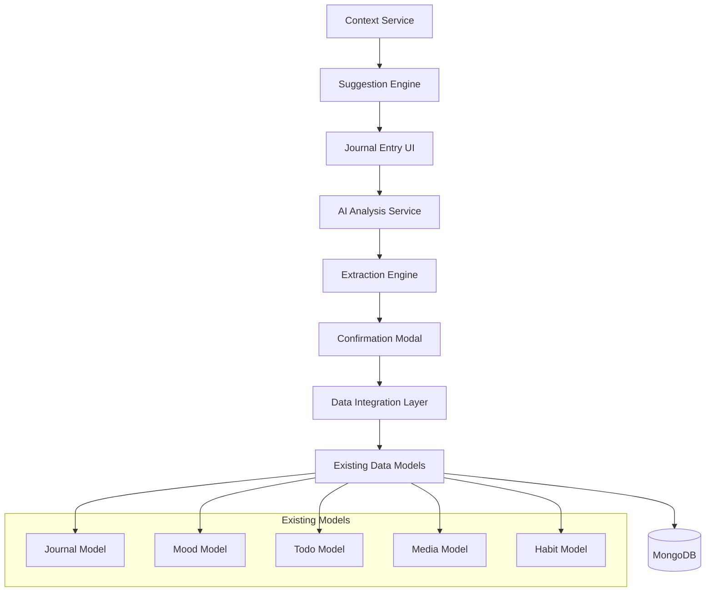

# Design Document

## Overview

The AI Journal Enhancement feature builds upon the existing journal functionality to provide intelligent categorization and contextual suggestions. The system leverages the current Groq AI integration to analyze journal entries and extract actionable data (mood, todos, media, habits) while providing contextual writing prompts based on user patterns.

The design maintains the existing architecture while extending it with enhanced AI capabilities and user confirmation workflows.

## Architecture

### High-Level Architecture



### Data Flow

1. **Journal Entry Creation**: User writes journal entry
2. **AI Analysis**: Content analyzed by Groq AI for extraction
3. **User Confirmation**: Extracted data presented for user approval
4. **Data Integration**: Approved items saved to respective collections
5. **Context Generation**: System analyzes user data for suggestions
6. **Suggestion Display**: Contextual prompts shown on journal open

## Components and Interfaces

### Frontend Components

#### Enhanced Journal Entry Component
- **Location**: `components/journal-entry.tsx` (existing, enhanced)
- **Responsibilities**:
  - Real-time AI analysis during typing
  - Display mood suggestions from AI
  - Show contextual writing prompts
  - Handle confirmation modal workflow

#### Journal Confirmation Modal
- **Location**: `components/journal-confirmation-modal.tsx` (existing, enhanced)
- **Responsibilities**:
  - Display extracted data with confidence scores
  - Allow editing of extracted items
  - Category reassignment interface
  - Batch approval/rejection controls

#### Contextual Suggestion Component
- **Location**: `components/journal-suggestions.tsx` (new)
- **Responsibilities**:
  - Display AI-generated writing prompts
  - Show relevant todos/mood-based suggestions
  - Provide prompt selection interface

### Backend Services

#### Enhanced AI Service
- **Location**: `backend/src/services/ai.service.js` (existing, enhanced)
- **New Methods**:
  - `generateContextualSuggestions(userContext)`: Generate writing prompts
  - `analyzeJournalContentRealtime(content)`: Lightweight analysis for typing
  - `extractDataWithConfidence(content, context)`: Enhanced extraction with confidence scores

#### Journal Context Service
- **Location**: `backend/src/services/journal-context.service.js` (new)
- **Responsibilities**:
  - Aggregate user data for context
  - Pattern analysis for suggestions
  - User preference learning

### API Endpoints

#### Enhanced Journal Routes
- `POST /api/journal/analyze-realtime`: Real-time content analysis
- `GET /api/journal/suggestions`: Get contextual writing prompts
- `POST /api/journal/save-extracted`: Save confirmed extracted data
- `GET /api/journal/context`: Get user context for suggestions

## Data Models

### Enhanced Journal Model
```javascript
// Existing fields remain, adding:
analysis: {
  summary: String,
  sentiment: String,
  keywords: [String],
  suggestions: [String],
  insights: String,
  confidence: Number, // New: Overall confidence score
  extracted: {
    mood: {
      value: String,
      confidence: Number // New: Confidence per extraction
    },
    todos: [{
      title: String,
      time: String,
      dueDate: Date,
      priority: String,
      confidence: Number // New
    }],
    media: [{
      title: String,
      type: String,
      status: String,
      confidence: Number // New
    }],
    habits: [{
      name: String,
      status: String,
      frequency: String,
      confidence: Number // New
    }]
  }
}
```

### User Preferences Model (New)
```javascript
const userPreferencesSchema = new mongoose.Schema({
  userId: { type: ObjectId, ref: 'User', required: true },
  journalPreferences: {
    autoAnalysis: { type: Boolean, default: true },
    suggestionTypes: [String], // ['mood', 'todo', 'media', 'habit']
    confidenceThreshold: { type: Number, default: 0.7 },
    rejectedSuggestionPatterns: [String] // Learning from user rejections
  },
  suggestionHistory: [{
    prompt: String,
    accepted: Boolean,
    date: Date
  }]
});
```

## Error Handling

### AI Service Failures
- **Graceful Degradation**: If AI analysis fails, save journal without analysis
- **Retry Logic**: Implement exponential backoff for API failures
- **Fallback Prompts**: Use generic prompts if contextual generation fails

### Data Extraction Errors
- **Confidence Thresholds**: Flag low-confidence extractions for user review
- **Validation**: Validate extracted data against model schemas
- **Partial Success**: Allow saving some extracted items even if others fail

### User Experience
- **Loading States**: Show analysis progress indicators
- **Error Messages**: Clear, actionable error messages
- **Offline Support**: Cache suggestions for offline use

## Testing Strategy

### Unit Tests
- **AI Service**: Mock Groq API responses, test extraction logic
- **Context Service**: Test data aggregation and pattern detection
- **Components**: Test user interactions and state management

### Integration Tests
- **API Endpoints**: Test full request/response cycles
- **Database Operations**: Test data persistence and retrieval
- **AI Integration**: Test with real AI service (limited)

### End-to-End Tests
- **Journal Workflow**: Complete journal entry to data extraction flow
- **Suggestion System**: Context generation to prompt display
- **Error Scenarios**: Network failures, AI service unavailability

### Performance Tests
- **Real-time Analysis**: Test typing performance with AI analysis
- **Context Generation**: Test suggestion generation speed
- **Database Queries**: Optimize context data retrieval

## Security Considerations

### Data Privacy
- **User Content**: Ensure journal content is encrypted at rest
- **AI Processing**: Minimize data sent to external AI services
- **User Control**: Allow users to disable AI features

### API Security
- **Authentication**: Verify user ownership of journal entries
- **Rate Limiting**: Prevent abuse of AI analysis endpoints
- **Input Validation**: Sanitize all user inputs

## Performance Optimizations

### Real-time Analysis
- **Debouncing**: Limit AI analysis frequency during typing
- **Caching**: Cache analysis results for similar content
- **Background Processing**: Analyze content asynchronously

### Context Generation
- **Data Aggregation**: Optimize database queries for context
- **Suggestion Caching**: Cache generated prompts per user
- **Lazy Loading**: Load suggestions only when needed

### Frontend Optimizations
- **Component Memoization**: Prevent unnecessary re-renders
- **Virtual Scrolling**: Handle large journal entry lists
- **Progressive Enhancement**: Core functionality works without AI

## Migration Strategy

### Database Updates
- **Schema Migration**: Add new fields to existing Journal model
- **Data Backfill**: Analyze existing journal entries for historical data
- **Index Creation**: Add indexes for new query patterns

### Feature Rollout
- **Feature Flags**: Gradual rollout to user segments
- **A/B Testing**: Test different suggestion algorithms
- **Monitoring**: Track usage and performance metrics

### Backward Compatibility
- **API Versioning**: Maintain existing API contracts
- **Component Compatibility**: Ensure existing journal functionality remains
- **Data Format**: Support both old and new analysis formats