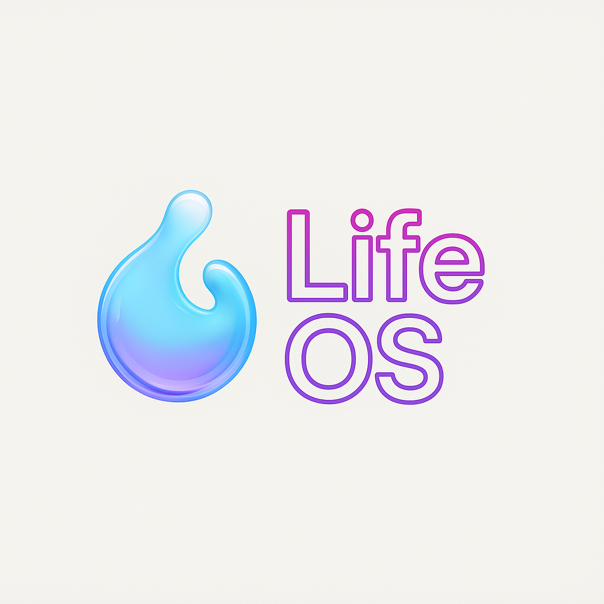

# Life OS - Your Personal Operating System for Life Management

<div align="center">
  
  <h3>A comprehensive productivity platform built with Next.js, Express.js, and AI</h3>
</div>

## 🌟 Overview

Life OS is a comprehensive productivity platform that serves as your personal operating system for life management. It combines traditional productivity tools with AI-powered insights to help you track habits, manage tasks, journal thoughts, monitor mood, achieve goals, and maintain overall life balance.

## ✨ Key Features

### 📊 **Dashboard & Analytics**
- Real-time productivity analytics and insights
- Visual charts for habit streaks, mood patterns, and goal progress
- Personalized recommendations based on your data
- Interactive tour system for new users

### 🎯 **Habit Tracking**
- Daily habit completion with streak tracking
- Visual progress indicators
- Habit categories and customization
- Historical data analysis

### 😊 **Mood Tracking**
- Emotional state logging with emoji-based interface
- Activity correlation tracking
- Energy level monitoring
- Mood pattern analysis over time

### 📝 **AI-Powered Journal**
- **Smart Content Analysis**: AI extracts todos, habits, media, and mood data from journal entries
- **Contextual Prompts**: AI generates personalized writing prompts based on your recent activities
- **Real-time Insights**: Live analysis while typing with suggestions and mood detection
- **Automatic Data Integration**: Extracted items can be automatically added to respective modules
- **Sentiment Analysis**: Advanced emotional analysis with actionable insights

### ✅ **Todo Management**
- Task creation with priorities and due dates
- Category organization
- Progress tracking
- Integration with journal AI extraction

### 🎯 **Goals & Milestones**
- SMART goal setting framework
- AI-generated milestone suggestions
- Progress tracking with visual indicators
- Deadline management

### 🔄 **Routines Builder**
- Morning, evening, and custom routine creation
- Step-by-step routine execution
- Progress tracking and optimization

### 🎬 **Media Tracking**
- Books, movies, TV shows, games, and podcast tracking
- Status management (planned, current, completed)
- Integration with external APIs (TMDB, Open Library, IGDB)
- AI extraction from journal entries

### 💰 **Finance Management**
- Expense tracking with categories
- Budget creation and monitoring
- Subscription management
- Account balance tracking
- Financial insights and analytics

### 🤖 **AI Coach (Spark)**
- **Personalized Coaching**: AI-powered life coach named "Spark"
- **Interactive Chat**: Real-time conversations with markdown support
- **Data-Driven Insights**: Analysis based on your productivity data
- **Motivational Support**: Encouraging feedback and actionable suggestions
- **Pattern Recognition**: Identifies trends in your behavior and productivity

### 🔐 **Authentication & Security**
- JWT-based authentication
- Google OAuth integration
- Secure password hashing with bcrypt
- Protected API routes
- Account management and deletion

### 🎨 **User Experience**
- **Dynamic Wallpapers**: Unsplash integration with theme-based backgrounds
- **Glass Morphism UI**: Modern, translucent design elements
- **Dark/Light Themes**: Automatic theme switching
- **Responsive Design**: Works on desktop, tablet, and mobile
- **PWA Support**: Progressive Web App capabilities
- **Interactive Tours**: Guided onboarding experience

## 🏗️ System Architecture

### Frontend (Next.js 15)
```
app/
├── api/                    # Next.js API routes
│   ├── ai/                # AI service endpoints
│   ├── analyze-journal/   # Journal analysis
│   └── journal-prompt/    # AI prompt generation
├── auth/                  # Authentication pages
├── [modules]/             # Feature modules (goals, journal, etc.)
components/
├── ui/                    # Reusable UI components (shadcn/ui)
├── [feature-components]   # Feature-specific components
contexts/
├── auth-context.tsx       # Authentication state
├── currency-context.tsx   # Currency management
hooks/
├── use-journal.ts         # Journal-specific hooks
├── use-media-query.ts     # Responsive design hooks
lib/
├── api.ts                 # API client configuration
├── auth.tsx               # Authentication utilities
├── utils.ts               # Utility functions
```

### Backend (Express.js + MongoDB)
```
backend/src/
├── config/
│   └── db.js              # MongoDB connection
├── controllers/           # Request handlers
├── middleware/
│   └── auth.js            # JWT authentication
├── models/                # MongoDB schemas
├── routes/                # API route definitions
│   ├── ai.routes.js       # AI service routes
│   ├── coach.routes.js    # AI coach endpoints
│   ├── journal.routes.js  # Journal management
│   └── [other-routes]
├── services/
│   └── ai.service.js      # AI integration (Groq)
└── utils/                 # Backend utilities
```

### Mobile App (React Native)
```
mobile-app/src/
├── components/            # Reusable mobile components
├── contexts/              # React contexts
├── hooks/                 # Custom hooks
├── navigation/            # Navigation configuration
├── screens/               # Screen components
├── services/              # API and external services
├── types/                 # TypeScript definitions
└── utils/                 # Utility functions
```

## 🤖 AI Integration

### AI Service Provider: Groq
Life OS uses **Groq** as the primary AI service provider for fast, efficient language model inference.

### AI Capabilities

#### 1. **Journal Analysis**
- **Content Extraction**: Automatically extracts todos, habits, media, and mood data
- **Sentiment Analysis**: Determines emotional tone and provides insights
- **Confidence Scoring**: Each extraction includes confidence levels (0.0-1.0)
- **Real-time Analysis**: Live analysis while typing with debounced requests
- **Pattern Recognition**: Identifies recurring themes and behaviors

#### 2. **Contextual Prompt Generation**
- **Personalized Prompts**: Based on recent moods, todos, and activities
- **Dynamic Suggestions**: Adapts to user patterns and preferences
- **Fallback System**: Ensures prompts are always available

#### 3. **AI Coach (Spark)**
- **Conversational AI**: Natural language interactions with personality
- **Data-Driven Coaching**: Uses productivity data for personalized advice
- **Motivational Support**: Encouraging and empathetic responses
- **Markdown Formatting**: Rich text responses with emojis

#### 4. **Smart Suggestions**
- **Goal Milestones**: AI-generated milestone breakdowns
- **Habit Recommendations**: Based on current patterns
- **Productivity Insights**: Weekly/monthly summaries

### AI Implementation Details

```javascript
// Example: Journal Analysis Flow
1. User writes journal entry
2. Content sent to Groq API with structured prompt
3. AI extracts structured data:
   - Mood: 😊 (Happy, confidence: 0.9)
   - Todos: ["Call doctor", "Buy groceries"]
   - Media: ["The Bear" (show, planned)]
   - Habits: ["Morning exercise" (done)]
4. User reviews and confirms extracted items
5. Items automatically added to respective modules
```

### AI Service Configuration
```javascript
// Retry logic with exponential backoff
// Debouncing for real-time analysis
// Confidence scoring for all extractions
// Fallback responses for service failures
```

## 🛠️ Tech Stack

### Frontend
- **Framework**: Next.js 15 with App Router
- **Language**: TypeScript
- **Styling**: Tailwind CSS + shadcn/ui components
- **State Management**: React Context + TanStack Query
- **Authentication**: JWT + Google OAuth
- **Charts**: Recharts
- **Forms**: React Hook Form + Zod validation
- **Icons**: Lucide React
- **Themes**: next-themes

### Backend
- **Runtime**: Node.js
- **Framework**: Express.js
- **Database**: MongoDB with Mongoose ODM
- **Authentication**: JWT + Google OAuth
- **AI Service**: Groq SDK
- **Security**: bcryptjs, express-rate-limit
- **Validation**: express-validator
- **Logging**: Morgan

### Mobile
- **Framework**: React Native 0.73+
- **Language**: TypeScript
- **Navigation**: React Navigation 6
- **State**: React Context + React Query
- **Storage**: AsyncStorage + Keychain
- **Testing**: Jest + React Native Testing Library

### External Services
- **AI**: Groq (Llama 3 models)
- **Images**: Unsplash API
- **Media Data**: TMDB, Open Library, IGDB
- **Authentication**: Google OAuth 2.0

## 🚀 Getting Started

### Prerequisites
- Node.js 18+
- MongoDB database
- Groq API key
- Google OAuth credentials
- Unsplash API key (optional)

### Environment Variables

#### Frontend (.env.local)
```env
NEXT_PUBLIC_API_URL=http://localhost:5001/api
NEXT_PUBLIC_GOOGLE_CLIENT_ID=your_google_client_id
NEXT_PUBLIC_UNSPLASH_ACCESS_KEY=your_unsplash_key
```

#### Backend (.env)
```env
PORT=5001
MONGODB_URI=your_mongodb_connection_string
JWT_SECRET=your_jwt_secret
GROQ_API_KEY=your_groq_api_key
GOOGLE_CLIENT_ID=your_google_client_id
GOOGLE_CLIENT_SECRET=your_google_client_secret
```

### Installation & Setup

1. **Clone the repository**
   ```bash
   git clone <repository-url>
   cd productivity-hub
   ```

2. **Install frontend dependencies**
   ```bash
   npm install
   ```

3. **Install backend dependencies**
   ```bash
   cd backend
   npm install
   cd ..
   ```

4. **Set up environment variables**
   - Copy `.env.example` files and configure with your keys

5. **Start the backend server**
   ```bash
   cd backend
   npm run dev  # Development mode
   # or
   npm start    # Production mode
   ```

6. **Start the frontend development server**
   ```bash
   npm run dev
   ```

7. **Access the application**
   - Frontend: [http://localhost:3000](http://localhost:3000)
   - Backend API: [http://localhost:5001](http://localhost:5001)
   - Health Check: [http://localhost:5001/health](http://localhost:5001/health)

### Mobile App Setup

1. **Navigate to mobile app directory**
   ```bash
   cd mobile-app
   npm install
   ```

2. **iOS setup** (macOS only)
   ```bash
   cd ios && pod install && cd ..
   ```

3. **Run the mobile app**
   ```bash
   # Android
   npm run android
   
   # iOS
   npm run ios
   ```

## 📱 Platform Support

- **Web**: Full-featured web application with PWA support
- **Mobile**: Native iOS and Android apps with offline capabilities
- **Desktop**: Web app works on all desktop browsers
- **Tablet**: Responsive design optimized for tablet usage

## 🔧 Development

### Available Scripts

#### Frontend
```bash
npm run dev          # Start development server
npm run build        # Build for production
npm run start        # Start production server
npm run lint         # Run ESLint
```

#### Backend
```bash
npm run dev          # Start with nodemon
npm start            # Start production server
npm test             # Run tests
```

#### Mobile
```bash
npm run android      # Run on Android
npm run ios          # Run on iOS
npm test             # Run tests
npm run lint         # Run linter
```

### Testing
- **Frontend**: Component testing with Jest
- **Backend**: API testing with Jest
- **Mobile**: React Native Testing Library
- **AI Services**: Mocked responses for testing

## 🚀 Deployment

### Production Deployment

#### Frontend (Vercel)
1. Connect GitHub repository to Vercel
2. Configure environment variables
3. Deploy automatically on push to main

#### Backend (Render/Railway)
1. Connect GitHub repository
2. Configure environment variables
3. Set up health check monitoring
4. Configure auto-deploy

#### Health Check Setup
To prevent cold starts, set up a cron job at [cron-job.org](https://cron-job.org):
- URL: `https://your-backend-url.com/health`
- Schedule: Every 5-10 minutes
- Method: GET

### Environment-Specific Configurations

#### Development
- Hot reloading enabled
- Debug logging active
- Development AI prompts
- Local database

#### Production
- Optimized builds
- Error logging only
- Production AI models
- Cloud database
- CDN for static assets

## 📊 API Documentation

### Authentication Endpoints
```
POST /api/auth/register     # User registration
POST /api/auth/login        # User login
POST /api/auth/google       # Google OAuth
POST /api/auth/refresh      # Token refresh
```

### AI Endpoints
```
POST /api/ai/journal-prompt      # Generate journal prompts
POST /api/ai/analyze-journal     # Analyze journal content
POST /api/ai/coach-feedback      # Get AI coach insights
```

### Core Feature Endpoints
```
# Journal
GET    /api/journal           # Get entries
POST   /api/journal           # Create entry
PUT    /api/journal/:id       # Update entry
DELETE /api/journal/:id       # Delete entry
POST   /api/journal/actions   # Save extracted items

# Habits, Todos, Goals, etc.
# Similar CRUD patterns for all modules
```

## 🤝 Contributing

1. Fork the repository
2. Create a feature branch
3. Make your changes
4. Add tests for new functionality
5. Ensure all tests pass
6. Submit a pull request

### Code Style
- TypeScript for type safety
- ESLint + Prettier for formatting
- Conventional commits
- Component-based architecture
- API-first design

## 📄 License

This project is proprietary and confidential.

## 🆘 Support

For support and questions:
1. Check the documentation
2. Review existing issues
3. Create a new issue with detailed information
4. Include steps to reproduce any bugs

---

<div align="center">
  <p><strong>Life OS - Your Personal Operating System for Life Management</strong></p>
  <p>Built with ❤️ using Next.js, Express.js, and AI</p>
</div>